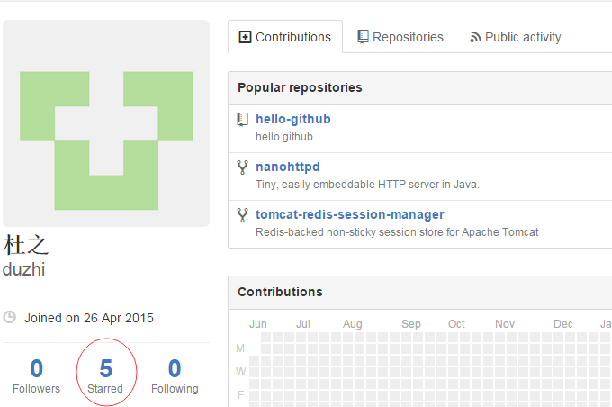

# hello-github
URL:https://github.com
hello github,study github

## organization
e.g.:https://github.com/alibaba

## personal
e.g.:https://github.com/duzhi

## project detail
两类：Branches和Tags，其中，branch中有一个master，进入项目默认位置，tag是releases,不可修改。  
初始创建或fork为master。

提交变更：  
1、Team->Commit  
2、Team->Push to Upstream at Project

## 查看所有的stars：Your stars
1、进入https://github.com/duzhi  
2、如图左下：  

